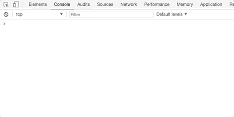
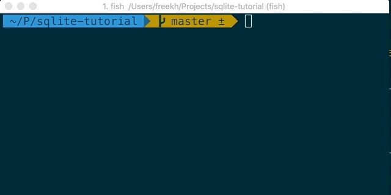

# Preface
This was written for adolencent me (and my nephew), that for some reason, wanted to know how to use Node and SQLite3 for web stuff -- and for anyone else who might be interested.

# What we're going to be building
This is a repository that contains _simple blogging platform_, where you can write a document and save it.
It looks like crap, but we don't care about that.

This file contains most of the what you need to know, in order to create something similar on your own.

Also, remember, adolescent me: don't stress when reading this - there's no point in finishing it quickly. I would recommend gazing over it, and then typing in everything on your own. Then think about how the thing you learnt might be useful to us.

# Basic JS (in the year 2018)
Node is a program that runs JavaScript (yes: that's what's JS stands for).

JS is a weird language in so many ways, but I'm not gonna dive too much into that (but a bit).
But for... reasons... it became the language of the web.
Which in turn, made it a language that runs almost anywhere. And even worse: it's the only language that runs in your browser.

One of the 'things' I just have to say about it though is that it changes.
A lot. All. The. Time.
But what you'll learn here, you'll probably be able to run in a browser (or in Node or whereever) in 10 years. Which is a lot in tech. Though I have to admit: I am really just making that up. Estimating is hard!

In anycase, that's why the title of this section includes the year it was written ;)

## Storing stuff in memory

Most useful programs stores and updates stuff.
Actually, most of the things you do with a computer is about storing and updating stuff.
In JavaScript you use `const` to store data that should never change (constant) and `let` for data that you'll want to update (variable).

Fun fact: the `var` keyword was _the_ keyword used to store and update data a while back, but since it's semantics (i.e. yeah: that's just a fancy words for "the way it works") is surprising to (reasonable people) developers coming from most other programming languages out there, so `const` and `let` were added. Google 'hoisting confusion' to know why.
Ok - that wasn't really that fun, but you might wonder about all those `var`s later so...

Since it's nice to try things out on your own, you could open up a browser (since it changes a lot I would go for the latest version of Google Chrome) and select View -> Developer -> Javascript Console.
It should look something like this:


Srsly, you should really do that now.
Yes, I know, adolencent me - you know this already.
You should do it still. Cause it will take you so little time, and when you can't do these basic stuff, you'll be completely lost later on. And you do things like that all the time, adolescent me... If you just took the time to learn things properly immediately, you would be like, so much smarter than what I'm right now...

So first off, let's create a couple of strings (of characters):
```JS
let characterMadeOfCharacters= 'Luke'; // this is a comment. and yes: there's many more star wars movies in the future
const evilLord = 'Darth'; // get it? these are all characters... hehehe...
```

Since `evilLord` is a `const` you cannot do this (or you can, but it won't sort of work):
```JS
evilLord = "Finn";
```

However, `characterMadeOfCharacters` is a `let` so you can do this:
```JS
characterMadeOfCharacters = 'Yooooda';
```

This is me doing something like that:


Yes, yes - I know you must be amazed. However: this means we already know enough to create an awesome program:
```JS
const yeah = 'woo7'; // 1337 speak is,like, really common today, yes, that weirds me out too...
console.log(yeah);
```

This won't work though:
```JS
console.log(no);
const no = 'noho';
```
If you imagine that your computer is just a machine (which it is), you have to tell it what what is before you start using it.

This leads us to the next chapter, which is...

## Blocks
The New Kids on the block was a 90's boyband and they also gave the name to what we in computer science calls blocks. Or not.
In anycase, blocks are defined by the stuff between a `{` and a `}`.
```JS
const fun = () => { // <-- block starts here
} // <-- and ends here
```

In most programming languages a block is a unit of stuff and most of the time it defines where variables (and other stuff) are available or, more importantly, where they are *not* available. How the computer know what's available (or not) is called a scope. 
So with our new found terminoly it we can sum it like this: a block in JS scopes variables (and stuff) so it is available in that scope but not in others.

So I can do this:
```JS
const fun = () => {
  const what = 'what?';
  console.log(what);
}
fun();
```

But not this:
```JS
const nofun = () => {
  const what = 'what?';
}
const fun = () => {
  console.log(what);
}
fun();
```
Us in the biz, says that `what` is outside of scope. Because that's what the error messages usually say. Or is it the other way around - I am not sure anymore :)

Interestingly, though the example below works. `what` is outside the block, but inside the scope. That's because blocks can be nested - and what is defined in the block 'above' the fun block.
```JS
const what = 'what?';
const fun = () => {
  console.log(what);
}
```

And that's... sort of... how scopes and blocks works. Sort of. You could look at wikipedia now and learn more about blocks and scopes, but I would say that if you sort of see what's going on, that's enough.

You probably should play around a bit though.

Again, I have to say: JS is weird cause: `var`s don't work like that, and that's weird for most people used to program. Let's just not think about that now, and simply just use `let`s (and `const`s instead).

## Conditionals
Conditional means that something happens only if some conditions are true.
Typically, you use `if`s for this.

Like this:
```JS
let fun = true;
if (fun) {
  console.log('This is fun? (No it is not really - but soon... Very soon :)');
} else {
  console.log("This will NEVER happen, y'all"); // see? I can use " and then have ' inside the string
}
```

## Arrays and objects
Other than strings and numbers and booleans (values that are either true or false), it's useful to have a value which can store other values.
In JS, you have arrays which look like this: `[1,2,3]` and objects that looks like this: `{hello:1}`.
I typically use arrays if I need to store a lot of the same thing: like a bunch of numbers for example, `[1,2,3]`. 

Objects I use whenever I need to store a lot of different things: like the name and age of a person for example. That would look something like this: `{name:'Fredrik', age: 36}` (yes I am really that old now - you'll be one day too!).

I don't have a good rule to when you use one or the other: like most things in science knowing about them is what you need to do. Then, you'll probably be able to figure what's the best in any given situation.

## Loops
We're almost there with the most basic stuff.

Once you know loops you could probably build WHATEVER you want.
You have different ways of looping over something, and that's built into JS: `for` and `while`.

Typically, I use `for` when I know that the computer knows, how many times it is going to loop.

This will print out the numbers 1 to 4 for example:
```JS
const alwaysAnArray = [1,2,3,4];
for (const a of alwaysAnArray) { // yes: alwaysAnArray has to be an array
  console.log(a);
}
```

You can also write `for` loops like this, which prints out 0 to 9:
```JS
const thisManyTimes = 10;
for (let i = 0; i < thisManyTimes; i++) { // i++ is the same as i = i + 1
  console.log(i);
}
```

The other statement, as these things are called, `while` you use if you want to do something until a condition changes.

Like this for example:
```JS
const forever = true;
while (forever) {
  console.log("Don't stop");
}
```
Which will print "Don't stop" like a boss...

## Functions
If you really paid attention, you already know what a function is.
If you didn't - I won't blame you, adolescent me, even adult you, would probably have missed it.

A function takes some parameters, does something with them and returns something.
In some ways, it is like just like a small program of its own.

That is a bit vague, but it's not that hard. Just have a look:
```JS
const funny = (a, b) => {
  const c = a + b;
  return c;
};
const one = 1;
const three = funny(one, 2); // that's 3 :)
```

And that's it: you have some parameters (`a` and `b`) and a block that defines what the function does.
You call like you see above: `a` is now 1 and `b` is 2 and that will run through the `funny` function, which really isn't very funny, and then it will return 3 and set the `const` `three` to be, yes you guessed it: 3.

One interesting, and again, yeah I know it might not be _that_ interesting, is that a function here is in fact a `const`, something stored in memory. 

This has a lot of interesting, again not that interesting :), implications like: you can pass a function as a parameter and return a function in a function. Just like the `one` in the example, you could send `funny` to another function, preferably to one that expects it though. These functinos are called higher order functions by people who like fancy names for everything. Like me.

In any case, yes: we're done with the basic stuff now :) Finally! :)
We'll continue to dive into functions though.

## Callbacks
So now we're not going to learn anything new. Callbacks that we're are going to talk about here, is basically just a function that is called by another function, and they are quite commonly used in JS.

For example:
```JS
const foo = (callback) => {
  let i = 0;
  while (i < 10) {  // count to 9
    console.log('i:', i);
    i++; // same as i = i + 1;
  }
  callback(i);
};
// and
const cb = (count) => { // yes: cb is short for callback
  console.log("we're done. we counted to " + count);
};

foo(cb); // will print out 0 to 9 then do done.
```

We'll do another example of this in a couple sections.

## Methods
So things, arrays, objects, strings, can have functions that operate on the thing itself, which we, in the biz, calls methods.
The thing in that last sentance is usually called a class, but it doesn't really makes sense in JS, so let's just look closer at methods because we don't really need to know much about classes to be able to be a really good programmer. In fact, I would argue, that the very best hardly uses classes these days at all :) (though: I do :)

So: enough with the chit-chat - here's an example of `Array`s `length` method:
```JS
const theLength = [1,2,3].length; // theLength is 3 - surprise!
```

Amazing! Let's have a look at another one: `map`.

## Map
So `map` is a method array has and it's a really useful one at that.
Map basically applies a function to all it's elements and returns a new array.
Most programming languages have a `map` method on arrays and other similiar looking... stuff... i.e. classes.

Here's me using it:
```JS
const addOne = (i) => {
  return i + 1;
};
[1,2,3].map(addOne); // I bet that really shows you the power of map... or not... :)
```

You can also do the very same thing, but without having to declare that `addOne`:
```JS
[1,2,3].map((i) => {
  return i + 1;
}); // YEAH!
```

So, the point here is just that there's methods and functions and you pass functions around to other functions and methods... And there's one called `map`, which I say is useful.
With that in mind let's continue into something a lot more complicated: Promises.

## Promises
I promised you adolescent me (and you, my nephew) that I would complete this tutorial in a day but didn't, I eventually managed to get it done though.

In JS, you also have promises. And just, like in RL (yes I abbreviate real life because I'm cool? No? I am not?), a Promise is something that may or may not complete and have some value after some time. Like the Array, it has methods (because it's a class). And, like the Array, it's used everywhere in JS so it's good to know how it works.

Before talking about how to create promises, we'll just call a function that returns one and have a look at it.
In your browser (at least in Chrome, but perhaps not all) you should be able to do this:

```JS
fetch('https://jsonplaceholder.typicode.com')
  .then((response) => console.log(response));
```

So, let's break that down a bit: `fetch` returns a Promise. This promise completes when the url, `https://jsonplaceholder.typicode.com` has finished loading. The `then` method lets you do something with the response. `then` will always return a new Promise, but, just as `map` lets you transform each of the elements in an array to a new array, `then` lets you transform value of the promise by returning a new promise with a different value.

So you can do this:
```JS
const aStatusPromise = fetch('https://jsonplaceholder.typicode.com')
  .then((response) => {
    return response.status; // this will return the status of response: 200 if OK for example...
  });
```

### TODO: returning Promises, another section on async/await

To create a Promise we have to apply everything we learnt so far and learn about another fun function that's built into JS: `setTimeout`.

### TODO: move up!

`setTimeout` basically takes a callback and runs it after a certain time in milliseconds. For example:
```JS
setTimeout(() => {
  console.log("I am 1000 milliseconds, that's a whole second, older now");
}, 1000);
```

Oki - we can use `setTimeout` to create a Promise with a value after a second like this:
```JS
const computeAnswer = (contemplateFor) => {
  return new Promise((resolve) => {
    setTimeout(() => {
      resolve(42);
    }, contemplateFor);
  });
};
computeAnswer(1000).then((answer) => {
  console.log('The answer is.... (drum roll)...', answer);
});
```
Wow - that's a lot, but you should sort of understand what's going on here...
`computeAnswer` is a function that returns a Promise. This promise is resolved, using the `resolve` callback after it has contemplated for `contempleteFor` milliseconds, in our case 1000.
That means, that the `then` method is called after 1000 ms and prints out "The answer is.... (drum roll)... 42"...
Which is unsurpising, especially if you have read the hitchhiker's guide to the galaxy (yes: that's where that 42 pun comes from)...

Pweeh. Don't worry, adolescent me... Most people find this a bit heavy - you'll get the hang of this eventually though :)

I had to walk you through this, because it's hard to talk about web sites these days without talking about promises.

But! Now you'll be glad to know: we're all done with the JS basics. If you sort of know this, you should be able to follow the rest.

# Node
So as I mentioned earlier Node is a program or app that runs JS.
Usually, you run it from your command line, because that's real 1337 (and also sort of practical once you get used to it).

You'll need to install it, so you need to google for `node installation` and so on and so on :)

Once you have done that: you can run it by going into you command line (in Windows it installs a program which you can run that has a command line; on Macs you just open your terminal app) and type in. wait for it... `node` :)
That's gets you into a console where you can type in lots of crap...

Here's me typing in stuff:


And here I create a file on the command line (this only works on Mac OS X and Linux such) and run it using node, because you can do that too:


## Modules

So the thing about node is that it also have npm, which lets you install other peoples code.
Which means you can do more and write less.

For example you can install all modules in this repository by doing:
```sh
npm install
```
Then you can run:
```sh
npm run watch
```

And go to `http://localhost:3000`.


# TODO:
Finish the rest of this... Sorry emil

# SQL
Before we start diving into database, lets start with why you could need a database.
First and foremost: a database is a convienient way to store and retrieve data from disk this time, not from memory.
You could write and read from files, but a database also let's you structure your data.
For example: a database let's you create a User that has a name and an email, very quickly.

If you wanted to read and write files, you would have to parse the text in the files. Find clever ways to optimize if you only want the name of a User and so on and so on... A database does all that for you and let's you focus on developping your app, not finding clever ways of reading and writing files.

The database we're going to use is SQLite3. There's a lot of other alternatives out there (Postgresql, MySQL, ...), but the basics are the same for all of these.
If you're wondering why all these have 'SQL' in them is because the language you use to interact (i.e. do stuff) with the database is


install sqlite3
create db, create table, insert, select, where, group by, join, delete, update

Express

Frontend

BONUS: Deploying to the cloud
Deploying should be simple enough if you're OK with using [heroku](https://www.heroku.com).

Go here to read their tutorial from `deploy the app`: https://devcenter.heroku.com/articles/getting-started-with-nodejs#deploy-the-app


# ######
`yarn add express`
https://expressjs.com/en/starter/installing.html

const express = require('express');
const app = express();

app.get('/', (req, res) => {
  res.send('Hello World!');
});

app.listen(3000, () => console.log('Example app listening on port 3000!'));

sqlite

https://github.com/mapbox/node-sqlite3

const sqlite3 = require('sqlite3').verbose();
const db = new sqlite3.Database(':memory:');

db.serialize(() => {
  db.run("CREATE TABLE lorem (info TEXT)");

  const stmt = db.prepare("INSERT INTO lorem VALUES (?)");
  for (let i = 0; i < 10; i++) {
    stmt.run("Ipsum " + i);
  }
  stmt.finalize();

  db.each("SELECT rowid AS id, info FROM lorem", (err, row) => {
      console.log(row.id + ": " + row.info);
  });
});

db.close();